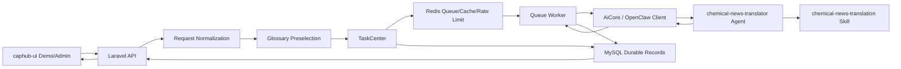

# Caphub Chemical Translation Platform Design

## Overview

This spec defines the first production-shaped AI capability for `caphub`: a professional translation service for chemical-industry news and related structured content.

The first feature is not just "text translation." It is the seed capability for a broader AI utility platform, where `caphub` provides:

- reusable AI-oriented backend interfaces
- asynchronous task orchestration
- operator-managed domain knowledge such as glossaries
- demo-oriented frontend pages that make each capability understandable and testable

The first concrete capability will support:

- synchronous and asynchronous translation APIs
- `plain_text` and `article_payload` inputs
- Chinese and English translation in both directions
- architecture ready for later multi-language expansion
- maintainable chemical glossary support
- OpenClaw-backed professional translation execution
- public demo pages plus an admin console

## Confirmed Product Decisions

The design is based on the following confirmed choices:

- The backend will provide both synchronous and asynchronous translation APIs, with the frontend demo primarily built around the async job flow.
- The translation service will support Chinese and English in both directions first, but the contract must remain extensible for more languages later.
- The backend will accept both `plain_text` and `article_payload`, then normalize both into a common internal document shape.
- The system will include a maintainable glossary capability, including standard translations, aliases, and forbidden translations.
- OpenClaw integration will use a dedicated professional translation agent that internally relies on a reusable chemical-news translation skill.
- The response contract must stay evolvable. Content will be returned as `translated_document` rather than permanently hard-coding `translated_title`, `translated_summary`, and `translated_body` at the top level.
- The frontend will be a new Vue 3 project named `caphub-ui`, with both a public demo area and an admin area.
- The `caphub-ui` frontend stack is fixed as `Vue 3 + Vite + Vue Router + Pinia + VueUse + @tanstack/vue-query + Tailwind CSS`, with `Element Plus` introduced for the admin area.
- The frontend must explicitly separate `DemoLayout` and `AdminLayout` rather than sharing one global shell across demo and admin surfaces.
- `Element Plus` should be limited to the admin area and a small number of business controls, and should not define the main demo visual language.
- `caphub-ui` must run in Docker and be structured for direct integration into the project's Docker/Compose workflow, so later migration and remote deployment do not depend on a host Node setup.
- Backend development should follow a local-authoring, remote-verification workflow: write code locally, but treat the remote Dockerized Sail environment as the authoritative place for backend debugging and verification.
- The platform should be shaped as a translation-first product with a minimal reusable AI task skeleton, not as a fully generalized AI platform on day one.

## Goals

- Deliver a high-trust chemical-news translation capability with explicit glossary control and risk visibility.
- Make the translation workflow demonstrable through a dedicated frontend, not just callable through APIs.
- Create a reusable backend pattern for later AI capabilities such as summarization, extraction, classification, and rewriting.
- Keep long-running or expensive tasks observable, retryable, and auditable through MySQL-backed task records and Redis-backed async execution.

## Non-Goals

The first version should not attempt to include:

- multi-provider AI switching
- a general workflow engine for arbitrary multi-agent orchestration
- customer- or tenant-isolated glossary management
- complex permission or billing systems
- automatic article crawling and scheduled translation ingestion
- websocket-first real-time infrastructure
- plugin-like frontend capability registration
- direct agent-side database access for glossary retrieval

## System Boundary

The platform consists of four main parts:

1. `caphub-dev` Laravel backend
2. OpenClaw translation execution layer
3. MySQL + Redis infrastructure
4. `caphub-ui` Vue 3 demo and admin frontend

The backend owns task state, glossary state, auditability, API contracts, and demo/admin behavior.

OpenClaw owns the professional translation reasoning and structured translation output.

Redis owns speed-oriented concerns such as queues, short-lived cache, and rate limiting.

MySQL owns durable truth: tasks, results, glossary records, and invocation logs.

## Recommended Architecture

The recommended architecture is a translation-first hybrid orchestration model:

- Laravel performs request normalization, glossary preselection, task persistence, async orchestration, result persistence, and API response shaping.
- OpenClaw performs professional translation using a dedicated agent backed by a reusable domain-specific skill.
- The backend exposes one stable product API surface regardless of how the OpenClaw internals evolve.
- The system extracts only the minimum reusable AI platform primitives that are clearly needed now: AI task model, OpenClaw client, agent binding, invocation log, and shared result schema handling.

This avoids two failure modes:

- an overly thin backend that pushes too much business behavior into prompts and agents
- an overbuilt platform that delays the first meaningful feature

## High-Level Component Model



## Backend Module Design

The Laravel backend should be organized into a translation domain plus a thin reusable AI substrate.

### Translation

Responsibilities:

- accept translation requests
- normalize input
- choose sync or async path
- perform glossary pre-processing
- invoke OpenClaw translation
- post-process translation output
- assemble frontend-facing responses

Suggested internal subcomponents:

- `TranslationRequestNormalizer`
- `TranslationModeResolver`
- `TranslationService`
- `TranslationResultAssembler`
- `TranslationRiskInterpreter`

### Glossary

Responsibilities:

- store standard chemical terminology mappings
- manage aliases and forbidden translations
- preselect relevant glossary entries for a request
- provide metadata used in translation result display

Suggested internal subcomponents:

- `GlossaryRepository`
- `GlossaryMatcher`
- `GlossaryPreselector`
- `GlossaryAdminService`

### AiCore

Responsibilities:

- provide a stable adapter from Laravel to OpenClaw
- map business use cases to concrete agent names
- build structured request payloads
- log invocation outcomes

Suggested internal subcomponents:

- `OpenClawClient`
- `AgentBindingRegistry`
- `TranslationAgentPayloadBuilder`
- `AiInvocationLogger`

### TaskCenter

Responsibilities:

- create and track async jobs
- provide polling-friendly status reads
- manage retries, status transitions, and terminal outcomes
- provide reusable conventions for later AI capabilities

Suggested internal subcomponents:

- `TaskStatusMachine`
- `TranslationJobService`
- `TranslationJobQueryService`
- `RetryPolicyResolver`

### Admin

Responsibilities:

- glossary management
- job inspection
- invocation inspection
- operational controls and dashboards

### DemoAccess

Responsibilities:

- anonymous demo request handling
- rate limiting
- simple usage logging
- public-safe response shaping

## API Design

### Public Demo Endpoints

- `POST /api/demo/translate/sync`
- `POST /api/demo/translate/async`
- `GET /api/demo/translate/jobs/{jobId}`
- `GET /api/demo/translate/jobs/{jobId}/result`

### Admin Endpoints

- `GET /api/admin/glossaries`
- `POST /api/admin/glossaries`
- `PUT /api/admin/glossaries/{id}`
- `GET /api/admin/translation-jobs`
- `GET /api/admin/translation-jobs/{id}`
- `GET /api/admin/ai-invocations`

### Input Contract

Both sync and async endpoints should accept one of these input modes:

- `plain_text`
- `article_payload`

Suggested request shape:

```json
{
  "input_type": "article_payload",
  "source_lang": "zh",
  "target_lang": "en",
  "content": {
    "title": "原文标题",
    "summary": "原文摘要",
    "body": "原文正文",
    "source_url": "https://example.com/article"
  }
}
```

The backend should normalize inputs into a single internal document model:

- `document_type`
- `source_title`
- `source_summary`
- `source_body`
- `source_text`
- `source_lang`
- `target_lang`
- `domain`

`domain` should be fixed to `chemical_news` for the first feature, but the internal shape should not prevent future domain expansion.

### Output Contract

The result shape should remain evolvable and should not permanently hard-code article-specific top-level fields.

Recommended public result shape:

```json
{
  "job_id": "uuid",
  "status": "succeeded",
  "input_type": "article_payload",
  "translated_document": {
    "title": "Translated title",
    "summary": "Translated summary",
    "body": "Translated body"
  },
  "glossary_hits": [],
  "risk_flags": [],
  "notes": [],
  "meta": {
    "mode": "async",
    "agent_name": "chemical-news-translator",
    "schema_version": "v1",
    "cache_hit": false,
    "duration_ms": 1450
  }
}
```

For `plain_text`, `translated_document` should use:

```json
{
  "text": "Translated text"
}
```

This makes the response contract flexible while keeping one common top-level structure.

### Sync/Async Strategy

The backend should implement both paths but keep one shared orchestration flow.

- Sync requests attempt fast execution for small inputs.
- Async requests always create a task and return `job_id`.
- If a sync request exceeds configured length or latency thresholds, it should transparently convert into an async task and return a structured "accepted-as-async" response.
- The backend should not hide this handoff. The client should receive the job identifier and use job polling.

## MySQL Data Model

The data model should stay lean but durable.

### `translation_jobs`

Purpose:

- primary record for translation requests and lifecycle

Key fields:

- `id`
- `job_uuid`
- `mode`
- `status`
- `input_type`
- `document_type`
- `source_lang`
- `target_lang`
- `source_title`
- `source_summary`
- `source_body`
- `source_text`
- `translated_title`
- `translated_summary`
- `translated_body`
- `translated_text`
- `error_code`
- `error_message`
- `created_at`
- `started_at`
- `finished_at`

Note:

The database may store translated title/body/text in separate columns for queryability, even though the API responds with `translated_document`.

### `translation_results`

Purpose:

- optional result detail table if the main job table becomes too wide

Recommended fields:

- `job_id`
- `translated_document_json`
- `risk_payload`
- `notes_payload`
- `meta_payload`

This table can be introduced from day one or deferred if storing JSON columns on `translation_jobs` is simpler.

### `glossaries`

Purpose:

- canonical glossary entries

Recommended fields:

- `id`
- `term`
- `source_lang`
- `target_lang`
- `standard_translation`
- `domain`
- `priority`
- `status`
- `notes`

### `glossary_aliases`

Purpose:

- alternate forms and matchable variants

Recommended fields:

- `id`
- `glossary_id`
- `alias`
- `match_type`

### `glossary_forbidden_translations`

Purpose:

- disallowed translations for a given glossary entry

Recommended fields:

- `id`
- `glossary_id`
- `forbidden_translation`
- `reason`

### `translation_glossary_hits`

Purpose:

- store which glossary entries were actually used or matched in each translation

Recommended fields:

- `id`
- `job_id`
- `glossary_id`
- `source_term`
- `chosen_translation`
- `match_text`
- `match_position`
- `hit_source`

### `ai_invocations`

Purpose:

- durable audit log for OpenClaw calls

Recommended fields:

- `id`
- `job_id`
- `agent_name`
- `skill_version`
- `request_payload`
- `response_payload_summary`
- `status`
- `duration_ms`
- `token_usage_estimate`
- `created_at`

### `demo_access_logs`

Purpose:

- light public demo monitoring and abuse control visibility

Recommended fields:

- `id`
- `ip_hash`
- `user_agent_hash`
- `action`
- `job_id`
- `created_at`

## Redis, Queue, and Cache Design

Redis should be used for fast, short-lived, operational concerns only.

### Queue Responsibilities

- hold async translation jobs
- separate high-priority and default queues if needed
- support worker concurrency tuning later

Suggested queue names:

- `translation-high`
- `translation-default`

### Cache Responsibilities

- cache translation results for repeated identical inputs
- cache should be keyed by content hash and context, not just raw text

Recommended cache key ingredients:

- input hash
- source language
- target language
- glossary version
- agent version

### Rate Limiting Responsibilities

- enforce anonymous demo request limits
- protect the backend and OpenClaw from public abuse

### Short-Lived State

- progress snapshots
- recent retry counters
- recent job lookup acceleration

### Durability Rule

Redis is not the system of record.

MySQL must remain the durable source for:

- final task status
- final translation result
- glossary hit records
- invocation logs

## Queue Job Strategy

The async flow should use a small number of well-bounded jobs.

Recommended first cut:

- `ProcessTranslationJob`
- `FinalizeTranslationJob`

Possible later expansion:

- `PrepareGlossaryContextJob`
- `PersistTranslationArtifactsJob`
- `RetryTranslationJob`

Recommended lifecycle:

- `pending`
- `queued`
- `processing`
- `succeeded`
- `failed`
- `cancelled`

Retry guidance:

- retry temporary infrastructure or provider failures up to two or three times
- do not retry validation errors or domain-invalid inputs
- log every failed invocation attempt

## OpenClaw Integration Design

OpenClaw should expose one stable translation agent to Laravel:

- `chemical-news-translator`

That agent should internally use one reusable skill:

- `chemical-news-translation`

### Agent Responsibilities

- accept a normalized translation task payload
- prepare OpenClaw execution context
- invoke the chemical translation skill
- return structured output in the agreed result schema

### Skill Responsibilities

- apply chemical-domain translation rules
- use glossary entries as strong translation guidance
- respect forbidden translations
- preserve entity fidelity for chemicals, companies, process names, units, codes, and abbreviations
- return translation plus structured risk observations

### Critical Boundary

The skill should not fetch glossary data directly from MySQL.

Laravel should preselect glossary context and send only the relevant glossary slice to OpenClaw. This keeps:

- latency more predictable
- prompts smaller
- data flow more auditable
- operational ownership clearer

### Suggested OpenClaw Request Shape

```json
{
  "task_type": "translation",
  "task_subtype": "chemical_news",
  "input_document": {
    "title": "source title",
    "summary": "source summary",
    "body": "source body"
  },
  "context": {
    "source_lang": "zh",
    "target_lang": "en",
    "glossary_entries": [],
    "constraints": {
      "preserve_units": true,
      "preserve_entities": true
    }
  },
  "output_schema_version": "v1"
}
```

### Suggested OpenClaw Response Shape

```json
{
  "translated_document": {
    "title": "translated title",
    "summary": "translated summary",
    "body": "translated body"
  },
  "glossary_hits": [],
  "risk_flags": [],
  "notes": [],
  "meta": {
    "schema_version": "v1"
  }
}
```

The exact field structure may evolve with the product's real usage patterns. The important rule is that the output must remain machine-readable and schema-versioned.

## Frontend Design: `caphub-ui`

The frontend should be a dedicated Vue 3 project focused on demonstration and operation, not a general-purpose marketing site.
Its default runtime target should be Dockerized execution rather than assuming host-local Node execution only.

### Public Demo Area

Suggested routes:

- `/demo/translate`
- `/demo/jobs/:jobId`
- `/demo/results/:jobId`

Main behaviors:

- switch between `plain_text` and `article_payload`
- select source and target languages
- choose fast sync mode or task mode
- show automatic handoff to async when the backend upgrades the request
- display translation result, glossary hits, risk flags, and metadata

### Admin Area

Suggested routes:

- `/admin/login`
- `/admin/dashboard`
- `/admin/glossaries`
- `/admin/jobs`
- `/admin/jobs/:jobId`
- `/admin/invocations`

Main behaviors:

- manage glossary entries, aliases, and forbidden translations
- review task history
- inspect OpenClaw invocation outcomes
- monitor queue-facing operational behavior

### Frontend Technical Recommendations

- Vue 3
- Vite
- Vue Router
- Pinia
- VueUse
- `@tanstack/vue-query`
- Tailwind CSS
- Element Plus (admin only)
- Docker
- a frontend runtime that integrates with `docker compose`
- a shared API client layer
- a shared polling composable for task status
- a shared result viewer component

The frontend layout should be explicitly split:

- `DemoLayout`: used by public demo pages, styled primarily with Tailwind CSS and custom presentation components to preserve an AI product feel.
- `AdminLayout`: used by the management area, built primarily with Element Plus to maximize CRUD, table, filter, and operational efficiency.

Suggested component boundary:

- demo hero sections, input panels, result cards, glossary-hit panels, risk panels, and task timelines should be custom Tailwind-first components
- admin tables, forms, dialogs, drawers, tabs, pagination, date pickers, and selects should default to Element Plus

Containerization requirements:

- `caphub-ui` must provide its own `Dockerfile`
- it must provide its own `compose.yaml` or a service definition that can be folded into the main Compose workflow
- local development should support running the Vite dev server inside a container
- deployment mode should support building the frontend in-container and serving it through a stable web service
- the frontend container must accept backend API base URL through environment variables
- remote deployment must not depend on a host-installed Node runtime

The UI should emphasize explainability:

- what the translated result is
- which glossary items were applied
- where the model sees risk or ambiguity
- how long the task took
- whether the response came from sync, async, or cache

## Error Handling

The system must be explicit about failures and uncertainty.

### Validation Errors

- reject invalid language pairs
- reject empty input
- reject malformed `article_payload`
- return machine-readable field errors

### Sync Timeout Behavior

- do not return a fake success
- return a structured accepted response with `job_id`
- instruct the frontend to transition into the async polling flow

### OpenClaw Temporary Errors

- mark the attempt as failed in invocation logs
- retry when appropriate
- expose final failure state at the job level if retries are exhausted

### Glossary Conflicts

- do not silently discard conflicts
- surface them through `risk_flags` or explicit glossary conflict notes

### Partial Confidence

The system should not pretend uncertain translations are certain. Risk markers should capture:

- ambiguous term translation
- uncertain abbreviation expansion
- suspicious source wording
- unit or numeric interpretation risk
- likely human-review-needed spans

## Security and Access

The first version should keep security pragmatic but real.

- public demo endpoints should be rate-limited
- admin endpoints should require authentication
- public demo logs should hash IP and user agent rather than storing raw values when possible
- invocation logs should be viewable only through admin interfaces
- OpenClaw credentials and backend secrets must stay server-side only

## Observability

The system should support day-two debugging from the start.

- store job lifecycle timestamps
- store invocation durations
- distinguish validation failures from provider failures
- record cache hits in result metadata
- make job state queryable from admin UI

## Testing Strategy

The first implementation should be tested at multiple layers.

Backend tests should use `Pest` as the standard test framework.

### Feature Tests First

Every externally exposed endpoint must have a complete Feature test covering at least:

- success path
- key validation failure path
- key state transition or side effect
- key response shape assertions
- key auth or rate-limit behavior when applicable

### Feature Tests

- sync translation request lifecycle
- async translation request lifecycle
- async polling result retrieval
- admin glossary CRUD
- anonymous demo rate limiting

### Integration Tests

- OpenClaw client request/response contract using stubs or fixtures
- queue job status transitions
- caching behavior for repeated requests

### Unit Test Strategy

- unit tests may be added, but they are not a gating requirement for continued implementation progress
- prioritize endpoint-level Feature coverage and key integration coverage first
- only add unit tests early when a pure logic module is complex enough that Feature coverage would be insufficient or unstable

### Non-Goals for Testing

Do not attempt to prove translation quality solely through snapshotting large generated passages. Focus on:

- schema validity
- glossary enforcement behavior
- risk flag propagation
- task lifecycle correctness

## Delivery Phases

### Phase 1: Backend Foundation

Deliver:

- translation domain core
- glossary core
- AI client integration
- task center
- sync and async APIs
- durable storage
- queue processing

### Phase 2: Demo and Admin Frontend

Deliver:

- public demo pages
- async job polling flow
- result viewer
- glossary management pages
- job and invocation views
- `caphub-ui` Dockerfile and Compose runtime configuration

### Phase 3: Minimal Reusable Platform Extraction

After translation is stable, formalize reusable primitives for later AI capabilities:

- shared AI task patterns
- shared OpenClaw client conventions
- shared result viewer patterns
- shared admin monitoring patterns

## Recommended Implementation Sequence

The first implementation plan should likely proceed in this order:

1. translation task model and status machine
2. glossary schema and matcher
3. OpenClaw client and translation agent payload builder
4. sync translation API
5. async translation API and queue worker
6. result persistence and glossary hit persistence
7. public demo rate limiting and task polling endpoints
8. Vue demo pages
9. Vue admin pages

## Final Recommendation

Treat the first release as a translation-first product with a minimal reusable AI platform skeleton.

Do not attempt to generalize more than the first feature proves necessary.

Use the chemical translation capability to establish:

- task orchestration conventions
- OpenClaw integration conventions
- glossary-driven domain control
- a reusable demo/admin presentation pattern

Once that first feature is stable, add the second AI capability and extract only the abstractions that both features genuinely share.
