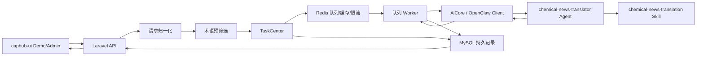

# Caphub 化工翻译平台设计

## 概述

本规格文档定义了 `caphub` 的第一个具备产品形态的 AI 能力：一个面向化工行业资讯及相关结构化内容的专业翻译服务。

首个功能不只是“文本翻译”，而是更大范围 AI 实用功能平台的起点能力。在这个平台中，`caphub` 将提供：

- 可复用的 AI 导向后端接口
- 异步任务编排能力
- 由运营或管理员维护的领域知识能力，例如术语库
- 面向演示的前端页面，用于清晰展示和验证每项能力

首个落地能力将支持：

- 同步与异步两套翻译 API
- `plain_text` 与 `article_payload` 两类输入
- 中英文双向翻译
- 为后续多语言扩展预留的架构
- 可维护的化工术语库能力
- 基于 OpenClaw 的专业翻译执行能力
- 公开 demo 页面与管理后台

## 已确认的产品决策

本方案基于以下已经确认的选择：

- 后端同时提供同步与异步翻译 API，前端 demo 以异步任务流为主。
- 翻译服务首期支持中英双向，但接口契约与内部结构必须可扩展到更多语言。
- 后端同时接受 `plain_text` 与 `article_payload`，并将两者统一归一化为一套内部文档结构。
- 系统需要具备可维护的术语库能力，包括标准译法、别名与禁用译法。
- OpenClaw 集成采用一个专门的专业翻译 agent，并由它内部复用一个可复用的化工资讯翻译 skill。
- 返回契约必须保持可演进性。内容将通过 `translated_document` 返回，而不是把 `translated_title`、`translated_summary`、`translated_body` 永久写死在顶层字段中。
- 前端将新增一个 Vue 3 项目 `caphub-ui`，同时包含公开 demo 区与管理后台区。
- `caphub-ui` 前端技术栈确定为 `Vue 3 + Vite + Vue Router + Pinia + VueUse + @tanstack/vue-query + Tailwind CSS`，并在 admin 区引入 `Element Plus`。
- 前端页面必须显式拆分 `DemoLayout` 与 `AdminLayout`，不能让 demo 页与后台页共用同一套整体壳子。
- `Element Plus` 只应用于 admin 后台和少量业务控件，不进入 demo 主视觉展示区。
- `caphub-ui` 必须以 Docker 方式运行，并具备可直接接入当前 Docker/Compose 体系的结构，方便后续迁移、远端部署与统一启动。
- 后端开发默认采用“本地编写代码，远端 Docker 环境调试与验证”的工作方式，后端可运行性应以远端 `Sail` 环境为准。
- 平台首期应当是“翻译优先”的产品形态，并只抽取最小可复用的 AI 任务骨架，而不是一开始就做成完全泛化的 AI 平台。

## 目标

- 交付一个高可信度的化工资讯翻译能力，具备显式术语控制与风险可见性。
- 让翻译流程可以通过独立前端进行演示，而不只是一个可调用的 API。
- 为后续 AI 能力，例如摘要、抽取、分类、改写，建立一套可复用的后端模式。
- 通过 MySQL 持久化任务记录、Redis 异步执行，使长耗时或高成本任务具备可观测、可重试、可审计能力。

## 非目标

首版不应尝试包含以下内容：

- 多 AI provider 切换
- 面向任意多 agent 编排的通用工作流引擎
- 面向客户或租户隔离的术语库管理
- 复杂权限系统或计费系统
- 自动抓取文章并定时翻译入库
- 以 WebSocket 为核心的实时基础设施
- 类插件化的前端能力注册机制
- 让 agent 直接访问数据库读取术语库

## 系统边界

平台由四个主要部分组成：

1. `caphub-dev` Laravel 后端
2. OpenClaw 翻译执行层
3. MySQL + Redis 基础设施
4. `caphub-ui` Vue 3 demo 与管理前端

后端负责任务状态、术语库状态、审计能力、API 契约以及 demo/admin 行为。

OpenClaw 负责专业翻译推理与结构化翻译输出。

Redis 负责偏速度导向的事项，例如队列、短期缓存与限流。

MySQL 负责持久化事实：任务、结果、术语记录与调用日志。

## 推荐架构

推荐采用“翻译优先的混合编排模型”：

- Laravel 负责请求归一化、术语预筛选、任务持久化、异步编排、结果持久化与 API 响应组装。
- OpenClaw 负责专业翻译执行，形式上是一个专用 agent，内部依赖一个可复用的领域 skill。
- 无论 OpenClaw 内部如何演进，后端都只暴露一套稳定的产品级 API。
- 系统只抽取当前明确需要的最小可复用 AI 平台原语：AI 任务模型、OpenClaw Client、agent 绑定、调用日志以及共享结果 schema 处理能力。

这样可以避开两个失败方向：

- 后端过薄，导致过多业务行为被塞进 prompt 和 agent 中
- 平台过重，导致第一个真正有价值的功能迟迟无法落地

## 高层组件模型



## 后端模块设计

Laravel 后端应组织为“翻译业务域 + 轻量可复用 AI 基础层”的结构。

### Translation

职责：

- 接收翻译请求
- 归一化输入
- 选择同步或异步执行路径
- 执行术语预处理
- 调用 OpenClaw 翻译
- 对翻译结果做后处理
- 组装面向前端的响应

建议内部子组件：

- `TranslationRequestNormalizer`
- `TranslationModeResolver`
- `TranslationService`
- `TranslationResultAssembler`
- `TranslationRiskInterpreter`

### Glossary

职责：

- 存储标准化工术语映射
- 管理别名与禁用译法
- 为当前请求预筛选相关术语条目
- 提供用于结果展示的术语元信息

建议内部子组件：

- `GlossaryRepository`
- `GlossaryMatcher`
- `GlossaryPreselector`
- `GlossaryAdminService`

### AiCore

职责：

- 作为 Laravel 与 OpenClaw 之间的稳定适配层
- 将业务用例映射为具体的 agent 名称
- 构造结构化请求载荷
- 记录调用结果

建议内部子组件：

- `OpenClawClient`
- `AgentBindingRegistry`
- `TranslationAgentPayloadBuilder`
- `AiInvocationLogger`

### TaskCenter

职责：

- 创建并跟踪异步任务
- 提供适合轮询的状态读取能力
- 管理重试、状态流转与终态结果
- 为后续 AI 能力提供可复用的任务约定

建议内部子组件：

- `TaskStatusMachine`
- `TranslationJobService`
- `TranslationJobQueryService`
- `RetryPolicyResolver`

### Admin

职责：

- 术语库管理
- 任务查看
- 调用日志查看
- 运营与管理面板控制

### DemoAccess

职责：

- 匿名 demo 请求处理
- 限流
- 简单使用日志
- 面向公开场景的安全响应组装

## API 设计

### 公开 Demo 接口

- `POST /api/demo/translate/sync`
- `POST /api/demo/translate/async`
- `GET /api/demo/translate/jobs/{jobId}`
- `GET /api/demo/translate/jobs/{jobId}/result`

### 管理接口

- `GET /api/admin/glossaries`
- `POST /api/admin/glossaries`
- `PUT /api/admin/glossaries/{id}`
- `GET /api/admin/translation-jobs`
- `GET /api/admin/translation-jobs/{id}`
- `GET /api/admin/ai-invocations`

### 输入契约

同步与异步接口都应支持以下输入模式之一：

- `plain_text`
- `article_payload`

建议请求结构：

```json
{
  "input_type": "article_payload",
  "source_lang": "zh",
  "target_lang": "en",
  "content": {
    "title": "原文标题",
    "summary": "原文摘要",
    "body": "原文正文",
    "source_url": "https://example.com/article"
  }
}
```

后端应将输入统一归一化为一套内部文档模型：

- `document_type`
- `source_title`
- `source_summary`
- `source_body`
- `source_text`
- `source_lang`
- `target_lang`
- `domain`

首个功能中，`domain` 固定为 `chemical_news`，但内部结构不应妨碍后续扩展更多领域。

### 输出契约

结果结构应保持可演进性，不应把面向资讯的字段永久写死在顶层。

建议公开返回结构：

```json
{
  "job_id": "uuid",
  "status": "succeeded",
  "input_type": "article_payload",
  "translated_document": {
    "title": "Translated title",
    "summary": "Translated summary",
    "body": "Translated body"
  },
  "glossary_hits": [],
  "risk_flags": [],
  "notes": [],
  "meta": {
    "mode": "async",
    "agent_name": "chemical-news-translator",
    "schema_version": "v1",
    "cache_hit": false,
    "duration_ms": 1450
  }
}
```

当输入是 `plain_text` 时，`translated_document` 应使用：

```json
{
  "text": "Translated text"
}
```

这样既能保持统一顶层结构，又能让结果契约在后续演进时更灵活。

### 同步/异步策略

后端应同时实现两条路径，但保持统一编排流程。

- 同步请求尝试对小输入进行快速执行。
- 异步请求始终创建任务并返回 `job_id`。
- 如果同步请求超过设定的长度或耗时阈值，应透明转换为异步任务，并返回结构化的“accepted-as-async”响应。
- 后端不应隐藏这一转换。客户端应拿到任务标识，并进入任务轮询流程。

## MySQL 数据模型

数据模型应保持精简但具备持久性。

### `translation_jobs`

用途：

- 作为翻译请求与任务生命周期的主记录表

关键字段：

- `id`
- `job_uuid`
- `mode`
- `status`
- `input_type`
- `document_type`
- `source_lang`
- `target_lang`
- `source_title`
- `source_summary`
- `source_body`
- `source_text`
- `translated_title`
- `translated_summary`
- `translated_body`
- `translated_text`
- `error_code`
- `error_message`
- `created_at`
- `started_at`
- `finished_at`

说明：

为了便于查询，数据库层可以继续把标题、正文、纯文本的译文分列存储，即使 API 对外统一通过 `translated_document` 返回。

### `translation_results`

用途：

- 当主任务表变得过宽时，作为可选的结果明细表

建议字段：

- `job_id`
- `translated_document_json`
- `risk_payload`
- `notes_payload`
- `meta_payload`

这张表可以从第一天就引入，也可以在首版中先把 JSON 存在 `translation_jobs` 中，后续再拆。

### `glossaries`

用途：

- 术语主表，存储标准术语条目

建议字段：

- `id`
- `term`
- `source_lang`
- `target_lang`
- `standard_translation`
- `domain`
- `priority`
- `status`
- `notes`

### `glossary_aliases`

用途：

- 存储术语的别名与可匹配变体

建议字段：

- `id`
- `glossary_id`
- `alias`
- `match_type`

### `glossary_forbidden_translations`

用途：

- 存储某个术语条目的禁用译法

建议字段：

- `id`
- `glossary_id`
- `forbidden_translation`
- `reason`

### `translation_glossary_hits`

用途：

- 记录一次翻译中哪些术语被实际命中或采用

建议字段：

- `id`
- `job_id`
- `glossary_id`
- `source_term`
- `chosen_translation`
- `match_text`
- `match_position`
- `hit_source`

### `ai_invocations`

用途：

- 作为 OpenClaw 调用的持久化审计日志

建议字段：

- `id`
- `job_id`
- `agent_name`
- `skill_version`
- `request_payload`
- `response_payload_summary`
- `status`
- `duration_ms`
- `token_usage_estimate`
- `created_at`

### `demo_access_logs`

用途：

- 作为公开 demo 的轻量访问监控与防滥用可视化依据

建议字段：

- `id`
- `ip_hash`
- `user_agent_hash`
- `action`
- `job_id`
- `created_at`

## Redis、队列与缓存设计

Redis 只应用于偏快、偏短生命周期、偏运行态的职责。

### 队列职责

- 承载异步翻译任务
- 根据需要区分高优先级与默认优先级队列
- 为后续 worker 并发调优提供基础

建议队列名：

- `translation-high`
- `translation-default`

### 缓存职责

- 对完全相同输入的翻译结果进行缓存
- 缓存 key 应包含内容与上下文，而不能只基于原始文本

建议缓存 key 组成要素：

- 输入内容 hash
- 源语言
- 目标语言
- 术语库版本
- agent 版本

### 限流职责

- 对匿名 demo 请求进行限流
- 防止公开接口滥用，保护后端与 OpenClaw

### 短生命周期状态

- 进度快照
- 最近重试计数
- 最近任务查询加速

### 持久性原则

Redis 不是系统事实源。

MySQL 必须作为以下数据的持久来源：

- 最终任务状态
- 最终翻译结果
- 术语命中记录
- 调用日志

## 队列 Job 策略

异步流程应只使用少量、职责清晰的 Job。

建议首版最小切分：

- `ProcessTranslationJob`
- `FinalizeTranslationJob`

后续可扩展为：

- `PrepareGlossaryContextJob`
- `PersistTranslationArtifactsJob`
- `RetryTranslationJob`

建议状态生命周期：

- `pending`
- `queued`
- `processing`
- `succeeded`
- `failed`
- `cancelled`

重试建议：

- 基础设施临时错误或 provider 临时错误可重试两到三次
- 参数校验错误或领域无效输入不应重试
- 每次失败的调用尝试都要被记录

## OpenClaw 集成设计

OpenClaw 应向 Laravel 暴露一个稳定的翻译 agent：

- `chemical-news-translator`

该 agent 内部应复用一个可复用 skill：

- `chemical-news-translation`

### Agent 职责

- 接收归一化后的翻译任务载荷
- 准备 OpenClaw 执行上下文
- 调用化工翻译 skill
- 按约定的结果 schema 返回结构化输出

### Skill 职责

- 应用化工领域翻译规则
- 将术语条目作为强约束或强提示使用
- 遵守禁用译法
- 保持化学品名、企业名、工艺名、单位、编号、缩写等实体的准确性
- 返回译文以及结构化风险观察结果

### 关键边界

skill 不应直接从 MySQL 获取术语数据。

Laravel 应先完成术语上下文预筛选，再只把当前请求相关的术语切片传给 OpenClaw。这样可以带来：

- 更可预测的延迟
- 更小的 prompt 体积
- 更可审计的数据流
- 更清晰的运维责任边界

### 建议的 OpenClaw 请求结构

```json
{
  "task_type": "translation",
  "task_subtype": "chemical_news",
  "input_document": {
    "title": "source title",
    "summary": "source summary",
    "body": "source body"
  },
  "context": {
    "source_lang": "zh",
    "target_lang": "en",
    "glossary_entries": [],
    "constraints": {
      "preserve_units": true,
      "preserve_entities": true
    }
  },
  "output_schema_version": "v1"
}
```

### 建议的 OpenClaw 响应结构

```json
{
  "translated_document": {
    "title": "translated title",
    "summary": "translated summary",
    "body": "translated body"
  },
  "glossary_hits": [],
  "risk_flags": [],
  "notes": [],
  "meta": {
    "schema_version": "v1"
  }
}
```

字段细节可以根据真实业务场景继续演进，关键原则只有一个：输出必须是机器可读的，并且带有 schema version。

## 前端设计：`caphub-ui`

前端应作为一个专门用于演示与运营的 Vue 3 项目，而不是一个通用营销站点。
前端运行方式应默认以 Docker 容器为目标，而不是把“本机 Node 直接运行”作为唯一运行模式。

### 公开 Demo 区

建议路由：

- `/demo/translate`
- `/demo/jobs/:jobId`
- `/demo/results/:jobId`

核心行为：

- 在 `plain_text` 与 `article_payload` 两种输入模式之间切换
- 选择源语言与目标语言
- 选择快速同步模式或任务模式
- 当后端自动升级为异步任务时，向用户清晰展示这一转换
- 展示翻译结果、术语命中、风险提示与元信息

### 管理后台区

建议路由：

- `/admin/login`
- `/admin/dashboard`
- `/admin/glossaries`
- `/admin/jobs`
- `/admin/jobs/:jobId`
- `/admin/invocations`

核心行为：

- 管理术语条目、别名与禁用译法
- 查看任务历史
- 查看 OpenClaw 调用结果
- 观察与队列相关的运行状态

### 前端技术建议

- Vue 3
- Vite
- Vue Router
- Pinia
- VueUse
- `@tanstack/vue-query`
- Tailwind CSS
- Element Plus（仅用于 admin 后台）
- Docker
- 与 `docker compose` 集成的前端运行方式
- 共享 API Client 层
- 共享任务轮询 composable
- 共享结果展示组件

页面布局应明确分层：

- `DemoLayout`：用于公开 demo 页面，使用 Tailwind CSS 自定义页面结构与展示组件，保持 AI 产品化演示风格。
- `AdminLayout`：用于后台管理页面，以 Element Plus 为主，优先保证表单、表格、筛选、CRUD 与运维视图的开发效率。

前端组件边界建议如下：

- Demo 主视觉区、输入面板、结果卡片、术语命中区、风险提示区、任务状态时间线，优先使用 Tailwind CSS 自定义实现。
- 管理后台中的表格、表单、Dialog、Drawer、Tabs、Pagination、DatePicker、Select 等高频管理型组件，优先使用 Element Plus。

前端容器化要求：

- `caphub-ui` 必须提供独立 `Dockerfile`。
- 必须提供独立 `compose.yaml` 或可被主项目 `compose` 引用的 service 定义。
- 本地开发模式应支持容器内运行 Vite dev server。
- 生产或演示部署模式应支持容器内构建静态资源并通过稳定的 Web 服务对外提供访问。
- 前端容器配置必须支持通过环境变量注入后端 API Base URL。
- 后续远端部署时，前端应能够作为独立服务迁移，而不依赖本机 Node 环境。

UI 应重点突出“可解释性”：

- 翻译结果是什么
- 哪些术语条目被应用了
- 模型在哪些地方认为存在风险或歧义
- 整个任务耗时多久
- 结果来自同步、异步还是缓存

## 错误处理

系统必须对失败和不确定性保持明确表达。

### 校验错误

- 拒绝非法语言对
- 拒绝空输入
- 拒绝格式错误的 `article_payload`
- 返回机器可读的字段级错误

### 同步超时行为

- 不返回伪成功结果
- 返回带有 `job_id` 的结构化 accepted 响应
- 指导前端切换到异步轮询流程

### OpenClaw 临时错误

- 在调用日志中标记该次尝试失败
- 在合适情况下进行重试
- 当重试耗尽后，在任务级别暴露最终失败状态

### 术语冲突

- 不要静默丢弃冲突
- 通过 `risk_flags` 或显式术语冲突说明暴露给调用方

### 部分置信度

系统不应把不确定的翻译伪装成确定结果。风险标记至少应覆盖：

- 术语译法歧义
- 缩写展开不确定
- 原文措辞可疑
- 单位或数值解释风险
- 可能需要人工复核的句段

## 安全与访问控制

首版安全策略应保持务实，但必须真实可用。

- 公开 demo 接口必须限流
- 管理接口必须要求登录
- 在可能情况下，公开 demo 日志应对 IP 与 User-Agent 做哈希处理，而不是直接存原始值
- 调用日志只应通过管理后台可见
- OpenClaw 凭证与后端密钥必须始终只保留在服务端

## 可观测性

系统应从一开始就支持第二天排障，而不是等到出问题再补。

- 存储任务生命周期时间戳
- 存储调用耗时
- 区分校验失败与 provider 失败
- 在结果元信息中记录缓存命中
- 让任务状态可从后台查询

## 测试策略

首期实现应覆盖多个层次的测试。

后端测试框架统一使用 `Pest`。

### Feature 测试优先

每个对外接口都必须有一份完整的 Feature 测试，至少覆盖：

- 成功路径
- 关键参数校验失败路径
- 关键状态变化或副作用
- 关键响应结构断言
- 关键鉴权或限流行为（如果该接口涉及）

### 功能测试

- 同步翻译请求生命周期
- 异步翻译请求生命周期
- 异步轮询结果获取
- 后台术语 CRUD
- 匿名 demo 限流

### 集成测试

- 基于 stub 或 fixture 的 OpenClaw Client 请求/响应契约测试
- 队列任务状态流转测试
- 重复请求的缓存行为测试

### 单元测试策略

- 单元测试可以补，但不是继续推进实现的前置条件
- 为了保证进度，优先完成接口级 Feature 测试与关键集成测试
- 只有当某个纯逻辑模块明显复杂且难以通过 Feature 测试稳定覆盖时，再补对应单元测试

### 测试非目标

不要试图仅通过大段生成文本快照来证明翻译质量。测试重点应放在：

- schema 合法性
- 术语约束是否生效
- 风险标记是否正确传递
- 任务生命周期是否正确

## 交付阶段

### Phase 1：后端基础能力

交付内容：

- 翻译业务核心
- 术语库核心
- AI Client 集成
- TaskCenter
- 同步与异步 API
- 持久化存储
- 队列处理

### Phase 2：Demo 与管理前端

交付内容：

- 公开 demo 页面
- 异步任务轮询流程
- 结果展示器
- 术语管理页面
- 任务与调用视图
- `caphub-ui` Dockerfile 与 compose 运行配置

### Phase 3：最小可复用平台抽取

当翻译能力稳定后，再正式沉淀供后续 AI 能力复用的通用原语：

- 通用 AI Task 模式
- 通用 OpenClaw Client 约定
- 通用结果展示模式
- 通用后台监控模式

## 建议的实现顺序

第一版 implementation plan 建议按以下顺序推进：

1. 翻译任务模型与状态机
2. 术语库 schema 与匹配器
3. OpenClaw Client 与翻译 agent 载荷构造器
4. 同步翻译 API
5. 异步翻译 API 与队列 worker
6. 结果持久化与术语命中持久化
7. 公开 demo 限流与任务轮询接口
8. Vue demo 页面
9. Vue admin 页面

## 最终建议

把首个版本当作“翻译优先的产品”，并只抽取最小可复用的 AI 平台骨架。

不要在第一个功能还没证明需求之前，就过早泛化。

用这次化工翻译能力来沉淀：

- 任务编排约定
- OpenClaw 集成约定
- 术语驱动的领域控制能力
- 可复用的 demo/admin 展示模式

当第一个功能稳定之后，再增加第二个 AI 能力，并只提炼两个真实功能都确实共享的抽象。
